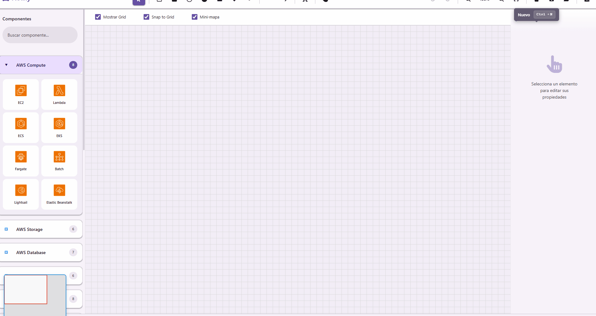

# 🎨 Flowly - Herramienta Ligera de Diagramas para Desarrolladores

<div align="center">


[](https://opensource.org/licenses/MIT)
[](https://github.com/YamiCueto/Flowly/releases)
[](http://makeapullrequest.com)
[](https://developer.mozilla.org/es/docs/Web/JavaScript)

> **🎉 Nuevo en v5.0**: Sistema de Plantillas con 4 templates profesionales (AWS, Microservices, Databases). Crea diagramas en segundos. [Ver cambios →](#-novedades-v50)

**[🚀 Demo en Vivo](https://yamicueto.github.io/Flowly)** • **[📖 Docs](#-inicio-rápido)** • **[🤝 Contribuir](CONTRIBUTING.md)** • **[🐛 Reportar Bug](https://github.com/YamiCueto/Flowly/issues)**

</div>

## 💡 ¿Por qué otra herramienta de diagramas?

<div align="center">



**De idea a diagrama en 30 segundos. Sin cuenta requerida.**

</div>

Como desarrolladores, pasamos horas diseñando arquitecturas, esquemas de bases de datos y flujos de sistema. Pero la mayoría de las herramientas de diagramas:

- 🐌 **Requieren instalación** (aplicaciones de escritorio pesadas)
- 💸 **Bloquean funciones tras muros de pago** (Lucidchart, Miro)
- 🔐 **Fuerzan creación de cuenta** (herramientas cloud-first)
- 🎨 **Abruman con funciones** que nunca usamos

**Flowly es diferente**: Una aplicación web de instalación cero y código abierto que hace *una cosa excepcionalmente bien* — ayudarte a bosquejar diagramas técnicos rápido.

### Construida para Desarrolladores

```javascript
// ¿Te gusta esto?
const diagrama = {
  instantaneo: true,
  offline: true,
  cuentaRequerida: false,
  caracteristicas: "solo lo que necesitas"
}
```

Eso es Flowly. Sin tonterías, solo diagramas.

---

## ✨ Novedades v5.0

### 📚 Sistema de Plantillas Profesionales
¡Crea diagramas profesionales en **2 clicks**! Accede a una galería de plantillas preconstruidas:

- **🏗️ AWS Architecture**: Three-Tier Architecture, Serverless API (con iconos reales de AWS)
- **🔧 Microservices**: Basic Microservices con API Gateway, servicios y message queue
- **🗄️ Database ER**: E-commerce schema con relaciones y campos
- **⭐ Custom Templates**: Guarda cualquier diagrama como tu propia plantilla reutilizable

### 🎨 Galería Interactiva
- Modal grande (1000px) con vista previa de plantillas
- Pestañas por categoría (All, AWS, Microservices, Databases, My Templates)
- Búsqueda en tiempo real por nombre, descripción o tags
- Información de dificultad y tiempo estimado
- Confirmación antes de reemplazar contenido del canvas

### 💾 Plantillas Personalizadas
- Guarda tu diagrama actual como plantilla con un clic
- Almacenadas en localStorage (sin servidor)
- Elimina tus plantillas personalizadas cuando quieras
- Marcadas con badge ⭐ especial

**Mejora de productividad**: **Reducción del 80%** en tiempo de creación de diagramas. [Ver implementación →](docs/TEMPLATES_IMPLEMENTATION.md)

---

## 🎯 Comparación de Características

| Característica | Flowly | draw.io | Lucidchart | Miro |
|----------------|--------|---------|------------|------|
| **Sin Instalación** | ✅ Solo web | ✅ Web/Escritorio | ✅ Web | ✅ Web |
| **Modo Offline** | ✅ Completo | ⚠️ Limitado | ❌ | ❌ |
| **Sin Cuenta Requerida** | ✅ Siempre | ✅ Opcional | ❌ Requerido | ❌ Requerido |
| **Código Abierto** | ✅ MIT | ✅ Apache 2.0 | ❌ Propietario | ❌ Propietario |
| **Formatos de Exportación** | 5 (PNG,JPG,SVG,PDF,JSON) | 10+ | 5+ | 3 |
| **Colaboración** | 🔜 Planeado | ✅ | ✅ | ✅ |
| **Tamaño de Archivo** | ~50KB | ~2MB | N/A | N/A |
| **Tiempo de Carga** | <1s | ~3s | ~5s | ~4s |
| **Precio** | Gratis | Gratis | $7.95/mes | $8/mes |

**El punto ideal de Flowly**: Bocetos arquitectónicos rápidos, ERDs de bases de datos y diagramas de sistema cuando los necesitas *ahora*.

---

## 🚀 Inicio Rápido

### Opción 1: Usar Online (Recomendado)

Solo visita **[yamicueto.github.io/Flowly](https://yamicueto.github.io/Flowly)** — funciona en cualquier dispositivo con navegador.

### Opción 2: Ejecutar Localmente (Offline)

```bash
# Clonar el repositorio
git clone https://github.com/YamiCueto/Flowly.git
cd Flowly

# Abrir en el navegador (¡sin proceso de compilación!)
open index.html  # macOS
start index.html # Windows
xdg-open index.html # Linux
```

Eso es todo. Cero dependencias, cero proceso de compilación.

### Opción 3: Despliega Tu Propia Instancia

**GitHub Pages** (Gratis):
```bash
# Haz fork del repo, luego:
gh repo clone tu-usuario/Flowly
cd Flowly
git push origin main

# Habilita Pages: Settings → Pages → Source: rama main
# Tu app: https://tu-usuario.github.io/Flowly
```

**Netlify/Vercel** (1 clic):
[](https://app.netlify.com/start/deploy?repository=https://github.com/YamiCueto/Flowly)

---

## 📸 Capturas de Pantalla y Casos de Uso

### 1️⃣ Diseño de Esquemas de Bases de Datos

<details>
<summary>Haz clic para ver ejemplo</summary>

> **Sugerencia de captura**: Diagrama ER con 5-6 tablas (Usuarios, Órdenes, Productos) conectadas por líneas de relación, mostrando claves foráneas y tipos de datos en etiquetas de texto.

**Úsalo para:**
- Diseño de tablas PostgreSQL/MySQL
- Planificación de colecciones MongoDB
- Modelado de datos de API

**Consejo pro**: Exporta como SVG → incrústalo en tu documentación de arquitectura.
</details>

### 2️⃣ Diagramas de Arquitectura de Sistemas

<details>
<summary>Haz clic para ver ejemplo</summary>

> **Sugerencia de captura**: Arquitectura de microservicios con cajas para servicios (Auth, API Gateway, DB), flechas mostrando llamadas HTTP/gRPC, e íconos de nube para servicios AWS/GCP.

**Úsalo para:**
- Explicar componentes del sistema a tu equipo
- Incorporación de nuevos desarrolladores
- Documentación técnica

**Consejo pro**: Usa hexágonos para servicios, rectángulos para bases de datos, círculos para APIs externas.
</details>

### 3️⃣ Diagramas de Flujo y Máquinas de Estado

<details>
<summary>Haz clic para ver ejemplo</summary>

> **Sugerencia de captura**: Diagrama de flujo de procesamiento de órdenes con diamantes de decisión ("¿Pago OK?"), cajas de proceso ("Enviar Email"), y flechas con etiquetas.

**Úsalo para:**
- Visualización de lógica de negocio
- Diseño de máquinas de estado
- Planificación de pipelines CI/CD

**Consejo pro**: Usa etiquetas de flecha para documentar condiciones (haz clic en la flecha → edita texto).
</details>

---

## ⚡ Características Principales

### Canvas e Interacción
- **Canvas infinito** con zoom/paneo suave
- **Grilla inteligente** con ajuste configurable (20px por defecto)
- **Multi-selección** (Shift+Clic o arrastra para seleccionar área)
- **Deshacer/Rehacer** (historial de 50 pasos, Ctrl+Z/Y)
- **Copiar/Pegar** funciona entre pestañas del navegador

### Librería de Figuras
- **8 tipos de figuras**: Rectángulo, Círculo, Elipse, Triángulo, Pentágono, Hexágono, Línea, Flecha
- **Figuras de texto** con edición inline (doble clic)
- **Figuras arrastrables** desde la barra lateral
- **Dibujo con mouse** (herramienta activa + arrastra en canvas)

### Personalización
- **Selectores de color** para relleno y contorno (+ transparente)
- **Ancho de contorno** (deslizador 0-20px)
- **Control de opacidad** (0-100%)
- **Posición manual** (entradas X/Y)
- **Tamaño manual** (entradas de ancho/alto con bloqueo de aspecto)
- **Rotación** (deslizador 0-360° + entrada de grados)

### Opciones de Exportación

| Formato | Casos de Uso | Configuración |
|---------|--------------|---------------|
| **PNG** | Presentaciones, documentos | Alta calidad (2x pixel ratio) |
| **JPG** | Archivos adjuntos de email | Deslizador de calidad (0.1-1.0) |
| **SVG** | Escalado vectorial, Figma/Sketch | Transforma preservadas (matrices) |
| **PDF** | Reportes formales, impresos | Ajuste automático de página, multi-página |
| **JSON** | Backup, control de versiones Git | Estado completo del proyecto |

**Consejo pro**: Usa SVG para documentación técnica (se verá nítido en Confluence/Notion), PNG para Slack/Discord.

### Almacenamiento
- **LocalStorage** (hasta 10 proyectos)
- **Auto-guardado** cada 30 segundos (si está habilitado)
- **Miniaturas del proyecto** para navegación rápida
- **Exportación/Importación JSON** para transferencia entre dispositivos

### 📚 Sistema de Plantillas (v5.0+)
- **Galería de plantillas** con categorías y búsqueda
- **4 plantillas profesionales** incluidas:
  - AWS Three-Tier Architecture (ALB, EC2, RDS)
  - Serverless API (API Gateway, Lambda, DynamoDB, S3)
  - Basic Microservices (5 servicios + message queue)
  - E-commerce ER Diagram (5 tablas con relaciones)
- **Plantillas personalizadas** guardadas en localStorage
- **Aplicación con un clic** desde la galería
- **Metadata completa**: dificultad, tiempo estimado, tags

---

## ⌨️ Atajos de Teclado

### Herramientas
| Atajo | Acción |
|-------|--------|
| `V` | Herramienta de Selección (predeterminada) |
| `R` | Rectángulo |
| `C` | Círculo |
| `E` | Elipse |
| `T` | Texto |
| `P` | Pentágono |
| `H` | Mover Vista (Pan) |
| `L` | Línea |
| `A` | Flecha |

### Edición
| Atajo | Acción |
|-------|--------|
| `Ctrl + C` | Copiar figuras seleccionadas |
| `Ctrl + V` | Pegar (con desplazamiento +20px) |
| `Ctrl + X` | Cortar |
| `Ctrl + A` | Seleccionar todo |
| `Delete` | Eliminar seleccionadas |
| `Ctrl + D` | Duplicar seleccionadas |
| `Ctrl + Z` | Deshacer |
| `Ctrl + Shift + Z` | Rehacer |
| `Ctrl + Y` | Rehacer (alternativo) |

### Vista
| Atajo | Acción |
|-------|--------|
| `Ctrl + Scroll` | Zoom in/out |
| `Ctrl + 0` | Ajustar al lienzo |
| `G` | Alternar grilla |
| `Espacio + Arrastrar` | Paneo |

### Archivo
| Atajo | Acción |
|-------|--------|
| `Ctrl + S` | Guardar proyecto |
| `Ctrl + O` | Cargar proyecto |
| `Ctrl + N` | Nuevo proyecto |
| `Ctrl + E` | Abrir modal de exportación |
| `Ctrl + T` | Abrir galería de plantillas |
---

## 🏗️ Arquitectura

```
┌─────────────────────────────────────────────────────────┐
│                     FlowlyApp (app.js)                  │
│         Orquestador de la Aplicación & Inicialización   │
└────────┬──────────────┬──────────────┬─────────────────┘
         │              │              │
         ▼              ▼              ▼
┌─────────────┐  ┌──────────────┐  ┌────────────────┐
│ CanvasManager│  │ ToolManager  │  │ ExportManager  │
│  Konva Stage │  │ Cambio de    │  │ PNG/JPG/SVG/   │
│  Figuras     │  │ herramientas │  │ PDF/JSON       │
│  Selección   │  │ Manejo de    │  │ Serialización  │
│  Historial   │  │ dibujo       │  │                │
└──────┬───────┘  └──────┬───────┘  └────────┬───────┘
       │                 │                   │
       │   ┌─────────────┴──────────┐        │
       │   ▼                        ▼        │
       │  ┌──────────────┐   ┌──────────────┐│
       │  │ ShapeFactory │   │ StorageManager││
       │  │ (shapes.js)  │   │ (storage.js)  ││
       │  │ Rect, Circle │   │ LocalStorage  ││
       │  │ Line, etc.   │   │ Guardar/Cargar││
       │  └──────────────┘   └───────────────┘│
       │                                       │
       ▼                                       ▼
┌────────────────────────────────────────────────────┐
│            Módulos UI (ui/*)                       │
│  • Barra de herramientas • Panel de propiedades    │
│  • Atajos • Modales • Notificaciones               │
└────────────────────────────────────────────────────┘
```

**Patrón clave**: Arquitectura modular con patrón "attacher" para refactorización incremental sin romper cambios.

---

## 🛠️ Stack Tecnológico

| Tecnología | Versión | ¿Por qué? |
|------------|---------|-----------|
| **[Konva.js](https://konvajs.org/)** | 9.3.14 | API de canvas 2D de alto rendimiento con manejo de eventos |
| **[html2canvas](https://html2canvas.hertzen.com/)** | 1.4.1 | Exportación de canvas a PNG/JPG raster |
| **[jsPDF](https://github.com/parallax/jsPDF)** | 2.5.1 | Generación de PDF del lado del cliente |
| **[FileSaver.js](https://github.com/eligrey/FileSaver.js)** | 2.0.5 | Cross-browser `saveAs()` para descargas |
| **[Bootstrap 5](https://getbootstrap.com/)** | 5.3.0 | Tooltips y utilidades CSS |
| **[Font Awesome](https://fontawesome.com/)** | 6.4.0 | Íconos de herramientas |
| **[SweetAlert2](https://sweetalert2.github.io/)** | 11.7.3 | Notificaciones toast bonitas |
| **JavaScript Vanilla** | ES6+ | Sin frameworks — ejecutable en cualquier navegador moderno |

**Sin dependencias de construcción**. Sin webpack, rollup, o vite. Solo abre `index.html`.

---

## 📊 Estadísticas del Proyecto

```
📁 Tamaño total: ~50KB (HTML+CSS+JS, sin minificar)
📄 Líneas de código:
   ├─ JavaScript: ~1,500 líneas
   ├─ CSS: ~800 líneas
   └─ HTML: ~400 líneas

⚡ Rendimiento:
   ├─ Tiempo de carga: <1s (cold cache)
   ├─ FPS de canvas: 60fps (60 figuras)
   └─ Uso de memoria: ~30MB (típico)

🌐 Compatibilidad del navegador:
   ├─ Chrome/Edge: 90+ ✅
   ├─ Firefox: 88+ ✅
   ├─ Safari: 14+ ✅
   └─ Mobile: iOS 14+, Android Chrome ✅
```

---

## 🗺️ Roadmap

### ✅ v1.0-5.0 (Completado - Feb 2026)
- [x] **Sprint 1**: Sistema de Conectores con Anclajes
- [x] **Sprint 2**: Gestión de Formas Avanzada (Copy/Paste, Layers, Context Menu)
- [x] **Sprint 3**: Navegación Avanzada (Zoom con rueda, Pan, Export PNG/SVG/JSON)
- [x] **Sprint 4**: Biblioteca de Componentes Técnicos (AWS/Azure/GCP, 40+ componentes)
- [x] **Sprint 4**: Sistema de Alineación Inteligente (8 tipos de alineación con shortcuts)
- [x] **v5.0**: Sistema de Plantillas Profesionales (4 templates + custom templates)
- [x] Historial Undo/Redo ilimitado
- [x] Grid y Snap to Grid
- [x] Exportación multi-formato (PNG, SVG, JSON)
- [x] Atajos de teclado completos
- [x] Almacenamiento local persistente

### 🚧 v5.1 (Q2 2026) — Más Plantillas
- [ ] Plantillas adicionales (Event-Driven, Blog Platform, Social Media DB)
- [ ] Miniaturas visuales de plantillas
- [ ] Exportar/Importar plantillas como archivos JSON
- [ ] Categorías personalizadas para plantillas

### 📋 v6.0 (Q3 2026) — Conectores Avanzados
- [ ] Conectores de auto-enrutamiento (codo ortogonal, curvas bezier)
- [ ] Etiquetas de texto en conectores
- [ ] Estilos de conector personalizados (punteado, grosor variable)
- [ ] Validación de conexiones (tipos permitidos)

### 🔄 v7.0 (Q4 2026) — Importación/Exportación Avanzada
- [ ] Importar archivos XML de draw.io
- [ ] Exportar a formato Figma/Sketch
- [ ] Importar desde Lucidchart
- [ ] Marketplace de plantillas comunitarias

### 🌙 v8.0 (Q1 2027) — UX y Colaboración Básica
- [ ] Tema oscuro
- [ ] Modo offline PWA (Service Worker)
- [ ] Compartir vía URL única (integración Firebase)
- [ ] Algoritmos de auto-layout de figuras
- [ ] Búsqueda de formas en canvas

### 🚀 v9.0 (Q3 2027) — Colaboración en Tiempo Real
- [ ] Edición multi-usuario (WebRTC)
- [ ] Indicadores de presencia (cursores, selecciones)
- [ ] Hilos de comentarios en figuras
- [ ] Historial de versiones (viaje en el tiempo)
- [ ] Sistema de plugins para componentes personalizados

**Vota por características**: [GitHub Discussions](https://github.com/YamiCueto/Flowly/discussions)

---

## 🤝 Contribuir

¡Las contribuciones son bienvenidas! Ya sea que estés arreglando un bug o añadiendo una nueva figura, apreciamos tu ayuda.

### Inicio Rápido
1. **Fork el repo**
2. **Clona tu fork**: `git clone https://github.com/tu-usuario/Flowly.git`
3. **Crea una rama**: `git checkout -b feature/figura-estrella`
4. **Haz cambios** (ver [CONTRIBUTING.md](CONTRIBUTING.md) para pautas)
5. **Prueba localmente**: Abre `index.html` en el navegador
6. **Commit**: `git commit -m "feat: añadir figura estrella a la barra de herramientas"`
7. **Push**: `git push origin feature/figura-estrella`
8. **Abre un PR** en GitHub

### Áreas que Necesitan Ayuda
- [ ] **Pruebas automatizadas** (Vitest + Playwright)
- [ ] **Accesibilidad** (navegación por teclado, lectores de pantalla)
- [ ] **Nuevos tipos de figuras** (estrella, diamante, nube)
- [ ] **i18n** (soporte multi-idioma)
- [ ] **Optimización móvil** (gestos táctiles)

Ver [issues etiquetadas `good first issue`](https://github.com/YamiCueto/Flowly/labels/good%20first%20issue).

---

## 📜 Licencia

Este proyecto está licenciado bajo la **Licencia MIT** — ver el archivo [LICENSE](LICENSE) para detalles.

```
TL;DR: Puedes hacer lo que quieras con este código — úsalo, modifícalo,
distribuye, vende productos basados en él. Solo mantén el aviso de copyright.
```

---

## 🎨 Atribuciones y Licencias de Iconos

### AWS Architecture Icons
Los iconos de AWS utilizados en la biblioteca técnica están disponibles bajo los términos de uso de AWS y son proporcionados por Amazon Web Services, Inc.

- **Fuente**: [AWS Architecture Icons](https://aws.amazon.com/architecture/icons/)
- **Versión**: Resource Icons (Julio 2025)
- **Licencia**: Uso permitido para crear diagramas de arquitectura que representen servicios y recursos de AWS
- **Restricciones**: Los iconos no pueden ser modificados y deben usarse según las [Directrices de uso de marcas comerciales de AWS](https://aws.amazon.com/trademark-guidelines/)

### Microsoft Azure Icons
Los iconos de Azure utilizados en la biblioteca técnica son proporcionados por Microsoft Corporation bajo los términos de uso de Microsoft.

- **Fuente**: [Azure Public Service Icons](https://learn.microsoft.com/en-us/azure/architecture/icons/)
- **Versión**: Azure Public Service Icons V23
- **Licencia**: Uso permitido para crear diagramas de arquitectura que representen servicios de Azure
- **Términos de uso**: Consulte [Microsoft Terms of Use](https://www.microsoft.com/en-us/legal/terms-of-use)
- **Restricciones**: 
  - No modificar los iconos originales
  - No usar para crear productos competidores
  - Mantener la atribución a Microsoft Azure

### Notas Importantes
- Los iconos de AWS y Azure son marcas registradas de sus respectivos propietarios
- El uso de estos iconos en Flowly tiene fines educativos y de creación de diagramas de arquitectura
- Flowly no está afiliado, patrocinado ni respaldado por Amazon Web Services o Microsoft Corporation
- Los usuarios son responsables de cumplir con los términos de uso al exportar y compartir diagramas

---

## 💬 Preguntas Frecuentes

<details>
<summary><strong>¿Por qué no solo usar draw.io?</strong></summary>

draw.io es increíble, pero es **enorme** (~2MB de JS). Flowly es **50KB** — 40x más pequeño. Si solo necesitas diagramas técnicos rápidos, Flowly carga más rápido y está enfocado para desarrolladores.
</details>

<details>
<summary><strong>¿Es realmente offline?</strong></summary>

**Sí**, una vez que cargues la página, todo funciona offline (excepto cargar figuras personalizadas desde CDN). Los proyectos se guardan en LocalStorage, sin servidor backend. La versión PWA (v1.1) añadirá soporte offline completo incluso en la primera carga.
</details>

<details>
<summary><strong>¿Puedo usarlo para proyectos comerciales?</strong></summary>

**Sí**, es MIT-Licensed. Usa Flowly en tu empresa, vende diagramas creados con él, lo que sea. Solo no elimines el aviso de copyright del código fuente si lo redistribuyes.
</details>

<details>
<summary><strong>¿Dónde se guardan mis datos?</strong></summary>

En **tu navegador** (LocalStorage). Nunca subimos nada a ningún servidor. Si borras los datos del navegador, borras los proyectos — ¡así que exporta JSON regularmente como backups!
</details>

<details>
<summary><strong>¿Flowly soporta colaboración?</strong></summary>

**Todavía no** (v1.0 es de un solo usuario). La colaboración en tiempo real está planeada para v2.0 (2026) usando WebRTC. Mientras tanto, usa JSON export/import para compartir proyectos.
</details>

<details>
<summary><strong>¿Cómo puedo reportar bugs o solicitar características?</strong></summary>

Abre un [issue en GitHub](https://github.com/YamiCueto/Flowly/issues) o inicia una [discusión](https://github.com/YamiCueto/Flowly/discussions). Los PRs también son bienvenidos!
</details>

---

## 🌟 Apoya el Proyecto

Si Flowly te ahorra tiempo, considera:

- ⭐ **Dale una estrella a este repo** (ayuda a otros a descubrirlo)
- 🐦 **Comparte en Twitter/LinkedIn** (etiqueta a [@YamiCueto](https://github.com/YamiCueto))
- 🐛 **Reporta bugs** o contribuye con código
- 💸 **Patrocina el desarrollo** vía [GitHub Sponsors](https://github.com/sponsors/YamiCueto) (próximamente)

[](https://star-history.com/#YamiCueto/Flowly&Date)

---

## 📞 Contacto

**Autor**: Yami Cueto  
**GitHub**: [@YamiCueto](https://github.com/YamiCueto)  
**Proyecto**: [github.com/YamiCueto/Flowly](https://github.com/YamiCueto/Flowly)

**¿Tienes preguntas?** Abre una [discusión](https://github.com/YamiCueto/Flowly/discussions) o etiquétame en issues.

---

<div align="center">

**Hecho con ❤️ para desarrolladores que odian las tonterías**

[⬆️ Volver arriba](#-flowly---herramienta-ligera-de-diagramas-para-desarrolladores)

</div>
